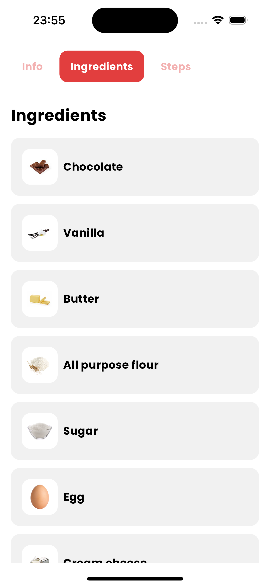
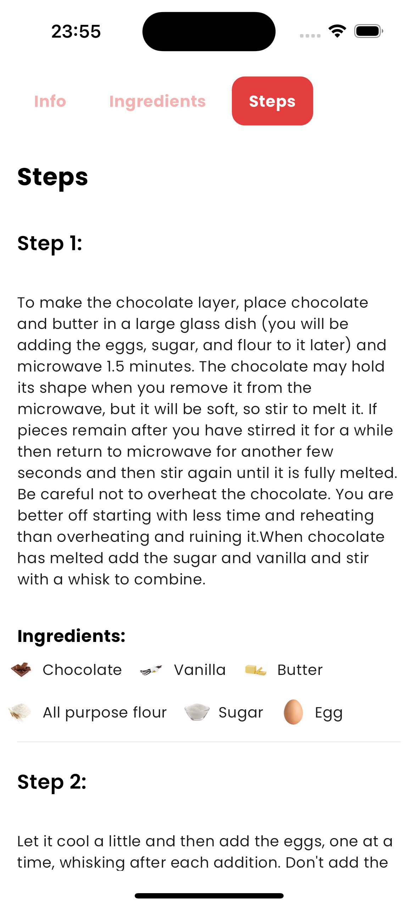

# Recipes app
## Flutter sample project

> This app uses spoonacular public API's free plan that allows only limited amount of requests. If the app doesn't load a content, check logs for the details. The limit may be exceeded.

## State management.

This code sample has two state management implementations - GetX and BLoC. 
These implementations are located in `lib/presentation/<specific implementation>` folder. Each folder have its own readme.md file that indicates information for this specific SM and the work progress.

